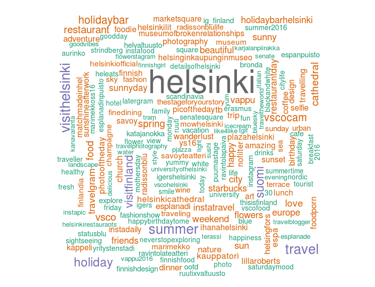

## Module 3: Extracting summary statistics from an R environment

This module aims to illustrate some aspects of integrating data gathered from APIs in an R environment for further processing.
In general, once we exported our data from the APIs in a more standardized format, we are able to process it with any statistics software. The purpose of this step is to
data exploration, creating charts and applying statistical tests.

We will use data from Instagram API that contains information of photos posted to Instagram since January 1, 2015 in downtown Helsinki. You can use the sample dataset of
[Instagram locations](../examples/locations.csv) and [Instagram photo metadata](../examples/photos.csv). These data filest were generated with this [script](../examples/insta.py)). ~~Try running it at home.~~ 

```
*Instagram API has changed its policy as of June 1, 2016. All registered applications start with limited access to data therefore the method presented above do not work with real data. Use the uploaded csv files above to complete this task.* 
```

Using this data allows us to extract insights about popular places in Helsinki, we can quantify data upload intensity and ultimately. Let's do this step by step. You can [download](module_3.R) all of the codes below as a standalone file if you prefer.

## Data import

The importance of this step is to actually load the data into R. You can connect R to PostgreSQL with the [`RPostgreSQL`](http://www.r-bloggers.com/r-and-postgresql-using-rpostgresql-and-sqldf/) pacakge, and import many other formats, such as [Shapefile](http://www.r-bloggers.com/shapefiles-in-r/)
or even [JSON](http://www.tutorialspoint.com/r/r_json_files.htm). In our case, the quickest way to get started is to read the CSV files.
Since we have the chance to study how the data is structured, we can come up the following lines of code:


```Rscript
locations <- read.csv('locations.csv', as.is=T, quote="\"")
photos <- read.csv('photos.csv', as.is=T, quote="\"")
# No quoting in this file. Always check source first!
hashtags <- read.csv('hashtags.csv', as.is=T, header=F)
```

This will give us 3 R data frames for the different sets of data we have. You can call the `head()` and `summary()` functions to examine if the data is correctly loaded. At this point, we should be able to
use all the powerful functionalities of R. `nrow(locations)` yields that we have 56 locations from Instagram ready. Let's draw a map of the spatial distribution.

The [`ggmap` *](https://journal.r-project.org/archive/2013-1/kahle-wickham.pdf) package extends the functionality of `ggplot2` with handy tools to managa spatial data, such as loading background tiles.

\* * D. Kahle and H. Wickham. ggmap: Spatial Visualization with ggplot2. The R Journal, 5(1), 144-161.*

Start with loading the neccessary packages
```Rscript
library('ggplot2')
library('plyr')
library('wordcloud')
library('ggmap')
```

Once the packages are loaded, continue with the creation of a map of locations.

```Rscript
# Set map center to the arithmetic mean of lat-long coordinates
center <- c(lon=mean(locations$lon), lat=mean(locations$lat))
# Init map background to OpenStreetMap tiles at zoom level 15
background <- get_map(location=center, source='osm', zoom=15)

# Create a ggmap object
map <- ggmap(background, extent='device') 

# Hint: typing map to the console (calling your object) will print out the background map

# Populate map plot with points using the geom_point() function
map <- map + geom_point(data=locations, aes(x=lon, y=lat), color='green', size=2)

# Heatmap style visualization of density with countour lines
map <- map + stat_density2d(data=locations, aes(x=lon,y=lat, fill = ..level.., alpha = ..level..), geom='polygon', size=.3) + 
    scale_fill_gradient(low='yellow', high='red', guide=F) +
    stat_density2d(data=locations, aes(x=lon, y=lat), bins=5, color='red', size=.3) + 
    scale_alpha(range=c(0, .2), guide=F)

# Finally, we can annotate our plot

map <- map + ggtitle('Instagram locations in Helsinki') + geom_text(data=locations, aes(x=lon, y=lat, label=name), size=5, check_overlap=T)

# Type "map" to the console again to see your final map.
```


The great thing about importing mined data is being able to use all the statistics tools that come with the software. Running the following lines tell us how many photos we gathered,
how many unique users posted those and we can also quickly extract the most popular places.

```Rscript
# Total number of photos
nrow(photos)

# Total number of unique users posting photos in these locations
length(unique(photos$username))

# Summarizing data by location
# Ceck out also count(), join() and merge() functions!
locations['user_count'] <- NA
locations['photo_count'] <- NA
# sapply() summarizes users by applying the length() function for all location_ids (i.e. what is the length of the list of users for a location?)
locations['user_count'] <- sapply(locations$id, function(x) length(unique(photos[photos$location_id==x,]$username)))
# Again, we answer to the question "How many rows do we have after truncating our photos data frame to the specific location?" with sapply()
locations['photo_count'] <- sapply(locations$id, function(x) nrow(photos[photos$location_id==x,]))

# Draw histograms to see how popularity of places is distributed

# Histogram of user counts by location
hist(locations$user_count)
# Histogram of uploaded photos for each location
hist(locations$photo_count)

# Extract top 20 places with most users
plot_data <- locations[order(-locations$user_count),][1:20,]
plot_data <- transform(plot_data[,c('name','user_count')], name = reorder(name, order(user_count, decreasing=T)))

# Create a bar plot of user counts for the 20 most visiteg locations
ggplot(plot_data, aes(x=name, y=user_count)) + geom_bar(stat='identity') + theme_bw() + theme(axis.text.x=element_text(angle=90), axis.title.x=element_blank()) + ylab('User counts')
```


Running statistical tests is also easy. For example we can check on the relationship between the number of `users tagged in each photo` and the `likes` photos have.

```Rscript
# Let's drop those photos with 0 tagged users and 0 likes
subset <- photos[photos$tagged_users > 0 & photos$likes > 0,]

# Since we're about to build a linear regression model, let's do a dummy normality check
hist(subset$likes)

# Log transform like counts since they're not normally distributed
likes <- log10(subset$likes)
tagged_users <- subset$tagged_users

# Build simple linear regression
reg <- lm(likes ~ tagged_users)
plot(tagged_users, likes)
abline(reg, col='red')

# Check the summary to see if the relationship is statistically significant
summary(reg)
```


We can also check the upload intensity of photos. Let's see what days of the week people like sharing their photos on Instagram.

```Rscript
# Extract the Day of Week from the timestamp
days <- format(as.Date(photos$created_at), format='%A')

# Calculate frequencies using the count() function from the plyr package
freq_table <- count(days)

ggplot(freq_table, aes(x=x, y=freq)) + geom_bar(stat='identity')  + theme_bw() + xlab('Day of week') + ylab('Photos uploaded') 
```

A nice visualization technique is using wordclouds. Instagram users can attach tags to each photo. Let's see what their photos were about.

```Rscript
# Let's count the occurances of each hashtag with the count() function
hashtag_freq <- count(hashtags)

# We can also rename the columns
names(hashtag_freq) <- c("hashtag","freq")

# Finally, let's generate a wordcloud. 
wordcloud(words=hashtag_freq$hashtag, freq=sqrt(hashtag_freq$freq), min.freq=1, max.words=200, rot.per=0.25,colors=brewer.pal(8,"Dark2"))

# Hint: type ?wordcloud in the console if you're using RStudio to see what additional parameters you can use to control the appearance of your wordcloud.
```

